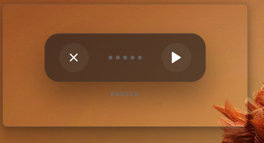

# VAKH - Offline AI Dictation

VAKH is a minimalist, high-performance desktop application for real-time voice-to-text dictation. It runs entirely offline using OpenAI's Whisper model, ensuring your voice data never leaves your computer.

## Features

- **100% Offline:** All processing is done locally. No API keys, no subscriptions, and no data collection.
- **Fast & Responsive:** Powered by Rust and Tauri for minimal overhead and low latency.
- **Universal Typing:** Works across all applications (Word, Slack, Browser, Terminal, etc.) by simulating keystrokes.
- **Smart Slicing:** Automatically flushes text every few seconds or at the end of sentences for a smooth flow.
- **Visual Feedback:** Real-time waveform visualization with color-coded states (Blue for listening, Green for speaking, Red for warnings).
- **5-Minute Sessions:** Support for long-form dictation up to 5 minutes per session.

## Usage

1. **Launch VAKH:** Open the application. A minimalist "orb" UI will appear at the bottom of your screen.
2. **Start Dictating:** Double-tap the **Left Ctrl** or **Right Ctrl** key to start listening. The UI will turn Blue.
3. **Speak:** As you talk, the UI will pulse Green. Your words will appear in the focused text field almost instantly.
4. **Stop/Finalize:** Double-tap **Ctrl** again (or click the stop button) to finalize the transcription.
5. **Hide/Close:** Press **Esc** or click the close button to hide the window.

## Installation

### Windows
1. Download the latest `vakh_0.1.0_x64_en-US.msi` or `vakh.exe` from the Releases page.
2. Run the installer.
3. Launch VAKH from your Start menu.

### Build from Source
If you want to build the project yourself:
1. Install [Rust](https://rustup.rs/) and [Node.js](https://nodejs.org/).
2. Clone this repository.
3. Run `npm install`.
4. Run `npm run tauri build` to generate the production binaries.

## Tech Stack

- **Backend:** Rust, [Tauri 2.0](https://tauri.app/)
- **AI Model:** [Whisper](https://github.com/openai/whisper) (embedded via `whisper-rs`)
- **Frontend:** Vanilla HTML/JS/CSS
- **Input Simulation:** Win32 API (`SendInput`)

## License

This project is licensed under the MIT License - see the [LICENSE](LICENSE) file for details.

## Disclaimer

VAKH uses a small, optimized version of the Whisper model (`tiny.en`). While very fast, it may occasionally hallucinate or make errors in complex environments.
