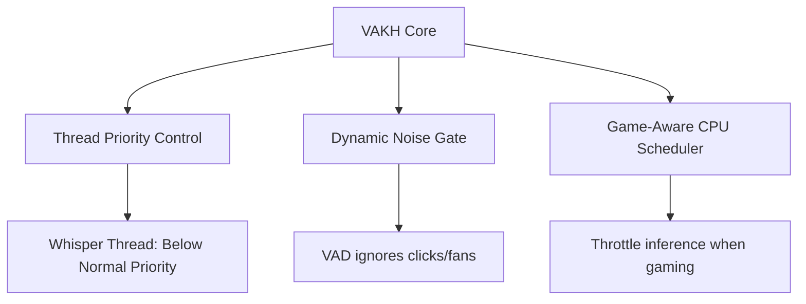

# VAKH V3: Architecture & Optimization Proposals

This document outlines the evaluation of the periodic dictation interval and proposes features for VAKH V3, focused on memory/CPU efficiency and user retention (especially for players/gamers).

---

## ⏱️ Interval Evaluation: 20s vs. 15s

Reducing the periodic dictation interval from **20 seconds to 15 seconds** changes how frequently Whisper inference runs:

| Metric | 20 Seconds (Current) | 15 Seconds (Proposed) | Tradeoff / Impact |
| :--- | :--- | :--- | :--- |
| **Inference Frequency** | Less frequent (3 times/min) | More frequent (4 times/min) | 15s increases CPU spikes by ~33%. |
| **Latency** | Higher (up to 20s delay) | Lower (max 15s delay) | 15s prints text faster, improving responsiveness. |
| **Context Length** | Larger audio context (better accuracy) | Smaller audio context | 20s has slightly better accuracy for continuous speech. |
| **Game FPS Impact** | Minimal interference | Higher chance of micro-stuttering | 20s is safer for heavy background tasks. |

### 💡 V3 Recommendation: Dynamic Intervals
To get the best of both worlds, implement **Context-Aware Intervals**:
- **Work Mode (VS Code, Word, Chrome):** Use **15 seconds** for fast response.
- **Game/Heavy Mode (Fullscreen games, heavy rendering):** Detect fullscreen apps or game processes via Win32 API and increase interval to **30 seconds** (or only flush on silence).

---

## 🎯 Alignment on Feature Rejections

1. **No Model Selection:** Confirmed. Baking in `tiny.en` keeps the zero-dependency distribution small, robust, and hassle-free.
2. **No User-Defined Manual Flush:** Confirmed. Preventing sudden word insertions/deletions maintains visual stability.
3. **Simple Auto-Formatting:** 
   - Highly recommended. It can be implemented using cheap regex-based capitalization and punctuation fixes on the text string.
   - **Zero CPU Cost:** Does not require AI or LLM formatting; runs instantly in Rust.

---

## ⚡ Player (Gamer) & System Optimizations for V3

To ensure VAKH runs quietly in the background without affecting game performance (FPS) or memory footprint:

### 1. Thread Priority Tuning (Critical)
Set the Whisper processing thread to `THREAD_PRIORITY_BELOW_NORMAL` or `THREAD_PRIORITY_IDLE` on Windows using the `windows-sys` crate. 
- **Benefit:** Windows will prioritize game rendering threads over transcription, ensuring zero FPS drops.

### 2. Auto-Mute / Smart Noise Gate
Gamers use mechanical keyboards with loud switches.
- **Benefit:** Upgrade VAD to ignore clicky sounds and background game audio, preventing the microphone from staying active indefinitely.

### 3. Physical Typing Overrides
- **Benefit:** If the user starts typing manually on their physical keyboard, immediately pause recording to prevent conflicting inputs.

### 4. Custom Gamer Vocabulary (Gamer Lexicon)
Provide a small list of custom hot-words to the Whisper parser (e.g., "gg", "afk", "wtf", "glhf", "npm").
- **Benefit:** Prevents phonetic hallucinations (e.g., translating "gg" to "gig").

=================old proposls======================
# VAKH Feature Proposals

Based on the core identity of VAKH as a native, completely local, and minimalist OS-level dictation tool, here are several feature enhancements that would elevate the application:

## 1. Voice-Activated Commands (Macros)
**Concept:** Recognize specific phrases to execute keystrokes instead of typing them.
**Examples:** 
- "New paragraph" -> `Enter` `Enter`
- "Delete that" -> `Ctrl + Backspace`
- "Undo" -> `Ctrl + Z`
**Value:** Reduces the need to touch the keyboard while dictating, making it truly hands-free.(yes we can impmenent need to discuss)

## 2. Advanced Settings Panel (UI)
**Concept:** A dedicated settings window to tweak the engine's behavior.
**Settings to include:**
- **VAD Sensitivity:** Adjust background noise filtering (useful for noisy environments, as mentioned in your recent issues).
- **Silence Timeout:** Let users choose the silence duration before a flush occurs (e.g., 2s, 4s, 6s).
- **Model Selection:** Option to download and use larger Whisper models (`base.en` or `small.en`) if the user has a powerful CPU.
(partially advicable)

## 3. Custom Vocabulary / Hotwords
**Concept:** Provide a way to feed a custom dictionary to the whisper model.
**Value:** Greatly improves accuracy for industry-specific jargon, names, or coding terminology (e.g., correcting "rust crate" instead of "rust create").
(we can discuss)

## 4. History & Clipboard Manager
**Concept:** Since VAKH already saves dictations to a local SQLite database, add a UI to view the history.
**Value:** Allows users to retrieve flushed text if the target application accidentally lost focus, or export their day's dictation.

## 5. Auto-Formatting Toggle
**Concept:** Automatically format the transcribed text based on the active window.
**Value:** For example, lowercasing everything and adding dashes for a terminal, or proper capitalization for Word.

---

## 💬 Evaluation & Recommended Direction for Old Proposals

Here is the evaluation of the 5 old proposals, optimized for gamers, low CPU, and small memory footprint:

### 1. Voice-Activated Commands (Macros) - **RECOMMENDED**
- **Gamer/CPU Impact:** **Zero.** Executes via regex mapping on the text string in Rust after Whisper completes, before keystroke injection.
- **Action:** Add support for key commands: `"new paragraph"` $\rightarrow$ `Enter + Enter`, `"delete last word"` $\rightarrow$ `Ctrl + Backspace`.
(we can discuss)

### 2. Advanced Settings Panel (UI) - **PARTIALLY IMPLEMENTED / REJECT MODEL SELECTION**
- **Gamer/CPU Impact:** **Zero.** Silence timeout, CPU thread count, and VAD sensitivity are already in the dashboard.
- **Action:** Reject the "Model Selection" settings. Keep the pre-packaged `tiny.en` to avoid user setup and installation bloat.
(not advicable)

### 3. Custom Vocabulary / Hotwords - **RECOMMENDED**
- **Gamer/CPU Impact:** **Zero.** Whisper allows feeding a comma-separated list of words as a prompt context (`initial_prompt`).
- **Action:** Add a textbox in Settings for custom gamer/developer terms (e.g., `"gg, afk, glhf, rust, tauri"`).
(its a long process)

### 4. History & Clipboard Manager - **PARTIALLY IMPLEMENTED**
- **Gamer/CPU Impact:** **Zero.** SQLite history logs are already stored and shown in the dashboard.
- **Action:** To keep memory usage low, avoid heavy clipboard syncing. Only add a simple "Copy to Clipboard" or "Export" button next to logs.
(already there)

### 5. Auto-Formatting Toggle - **RECOMMENDED AS OPT-IN**
- **Gamer/CPU Impact:** **Extremely Low.** Fast regex processing in Rust.
- **Action:** Provide a "Smart Formatting" toggle (sentence capitalization, auto-spacing, fixing `"i"` $\rightarrow$ `"I"`) rather than complex window-dependent rules.
(not for gamers we choose latency of the app ,atleast we need that for or dev on feature and future dev)

---

## 🧠 Deep & Model-Level Proposals (Multilingual & Optimizations)

These proposals introduce deep engine changes, multilingual capabilities, and system optimizations for gamers:

### 1. Multilingual Support & Real-Time Translation
- **Concept:** Replace the English-only `tiny.en` model (~77MB) with the multilingual `tiny` model (~77MB).
- **Features:**
  - **Auto-Detect Language:** Auto-detects spoken languages (Hindi, Spanish, French, etc.) and transcribes in that language natively.
  - **Speech-to-Translate:** Direct, real-time translation from spoken foreign languages into written English text.
- **CPU/Memory Impact:** Zero difference compared to `tiny.en`.

### 2. Model Quantization (4-bit/5-bit)
- **Concept:** Compile VAKH with a quantized `Q4_0` or `Q5_0` Whisper model.
- **Benefit:** 
  - Reductions in file size/memory usage from ~77MB to ~30MB.
  - Up to 40% faster inference on low-end CPUs, reducing background thread spikes.

### 3. CPU Core Pinning & Thread Affinity
- **Concept:** Pin the Whisper inference threads to efficiency cores or set background priority.
- **Benefit:** Avoids CPU cache eviction and prevents micro-stuttering in heavy 3D games.

### 4. Neural Audio Noise Suppression (RNNoise)
- **Concept:** Run a tiny, lightweight neural noise gate (like RNNoise) in the audio stream before VAD.
- **Benefit:** Pre-cleans fan hums and clicky mechanical keyboard sounds to improve Whisper transcription accuracy in noisy rooms.

